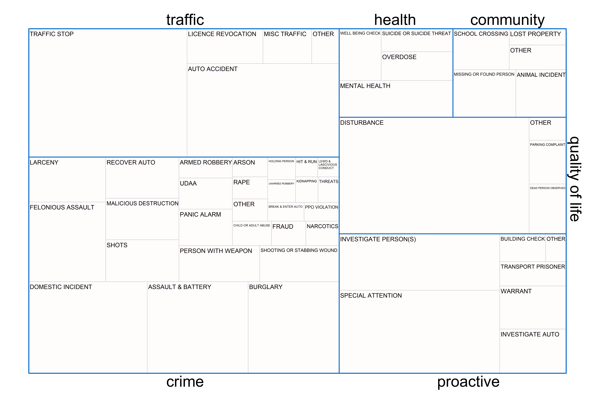
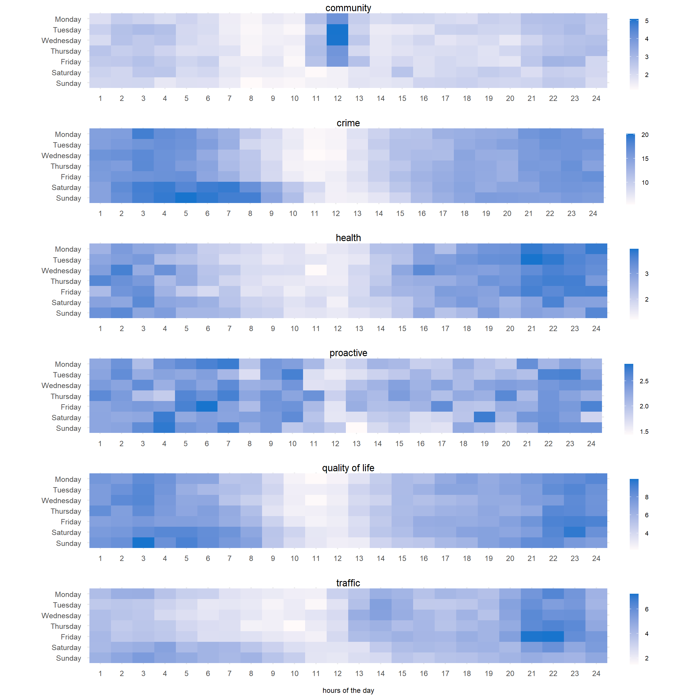
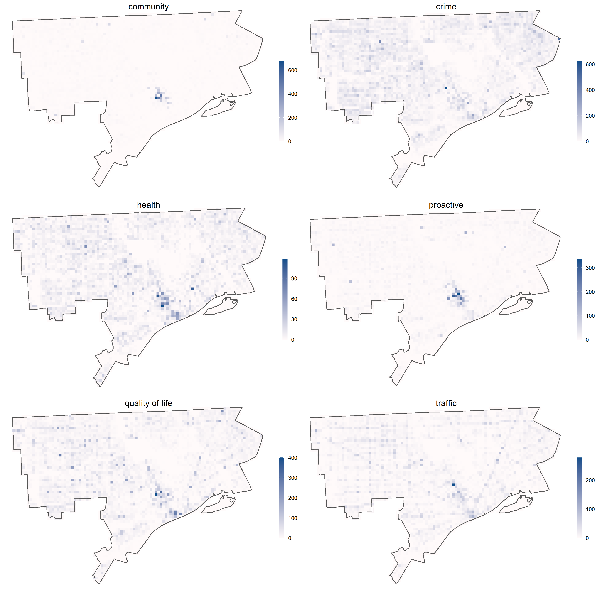

```{r setup, include=FALSE}
knitr::opts_chunk$set(echo = F, message=F, comment=F, warning=F)
```

## Police demand

There is a common misconception that police spend most of their time responding to and dealing with crime. Instead, the evidence suggests that public demand for police services originates from a diverse array of incidents -- many of which involve vulnerable people and require specific training and numerous

Estimating the scale of demand of police services is not a simple task, particularly when it comes to complex sources of demand, such as those originating from persons with mental ill-health. One common method has been to use emergency calls for service data. For instance, we can say _how many_ emergency calls were classified as involving mental ill-health in any given time period. We can take this one step further by calculating the _amount of time_ police spend dealing with such incidents. We can then make claims such as: "Police officers spend x% of their time responding to and resolving incidents involving mental ill-health". 


Gathering such evidence -- which simply _describes_ the composition of public demand for the police -- is important for a number of reasons. Among them, it can help guide training to ensure that officers are suitably prepared for their duties, maximising well-being outcomes for the public and mitigating against unnecessary strain on officers. Understanding police demand can also contribute to how funds from central and local governments are decided and distributed to police forces and other public services. This has become particularly pertinent following recent 'defund the police' campaigns. With police performing a variety of non-crime-related duties, any changes to their role will likely have a knock-on effect to other sectors (and vice-versa).

\newpage

\begin{landscape}

```{r fig1, fig.align = "center", fig.cap = "Proportional breakdown of deployed time spent on each incident category."}

```

\end{landscape}

\newpage

```{r fig2, fig.align = "center", fig.cap = "Mean incident counts by day and week by demand type.", out.width = "\\textwidth"}

```


```{r fig3, fig.align = "center", fig.cap = "Spatial patterning of total incident counts by demand type.", out.width = "\\textwidth"}

```