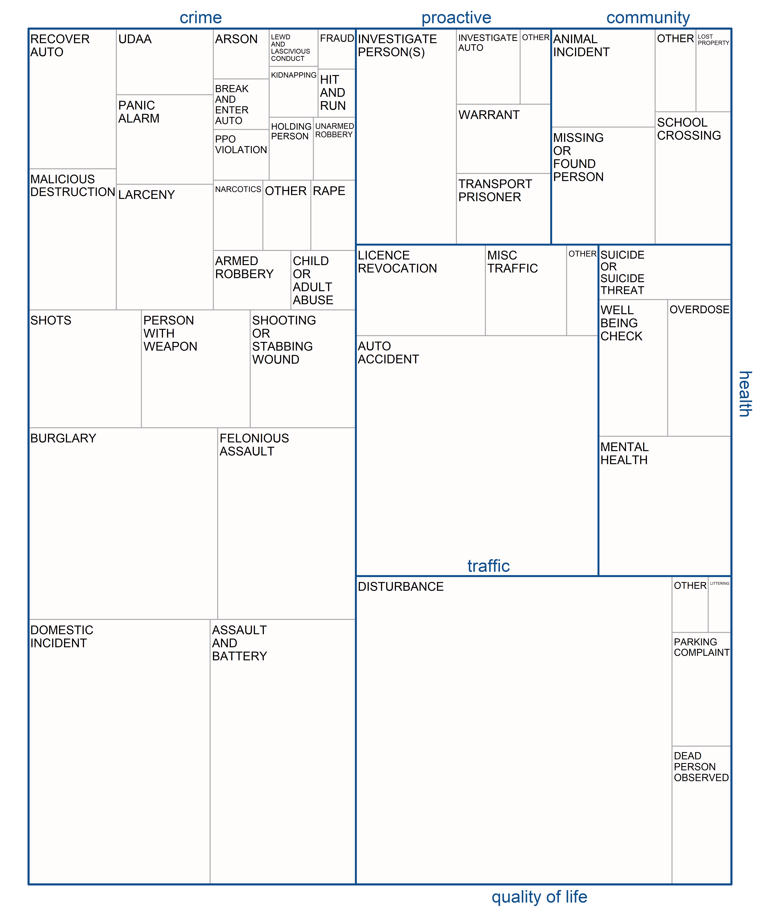

Keywords: police, calls for service, 911, demand, reactive.

```{r setup, include=FALSE}
knitr::opts_chunk$set(echo = F, message=F, comment=F, warning=F, fig.pos = 'H')
library(readr)
library(dplyr)
library(kableExtra)
```

## Introduction

Amidst austerity measures, growing public expectation, and scrutiny, understanding the public demand for police services has become a priority among evidence-based policing researchers and practitioners [@boulton2017calls]. Without a grasp on the scale ('how much?') and composition ('what type?') of police demand, we are likely to observe sub-optimal and inequitable outcomes for the public, the inappropriate distribution of public funds, and unnecessary strain on officers [@ellison2021understanding; @lum2021can]. Understanding the characteristics public demand for the police has become particularly pertinent following recent calls to rethink, and some cases, radically reform, the role and reach of contemporary police forces [@lum2021can].

A study from @ratcliffe2021policing in _Crime Science_ sought to describe the complexity and diversity of public demand for police services in Philadelphia, United States. The study was motivated by the recognition that police spend a considerable proportion of deployed resource resolving incidents which fall outside the traditional crime-fighting role of the police. Instead, the origins of public demand for the police can often be attributed to a lack of supply and/or accessibility failure in other organisations, such as those providing support for people requiring (mental) health assistance [@wood2021can; @van2017law]. The study's findings provided data-driven evidence to suggest that the police indeed spend considerable amounts of time dealing with incidents that could be resolved by other -- often more appropriate -- agencies. Comparable findings were subsequently reported in the United States across multiple (anonymised) police jurisdictions [@lum2021can]. In advance of recent contributions, this short paper aims to describe the public demand for police services in Detroit, United States, using open data and open code which can be used to reproduce the findings (see xxxxxxxxxxxxxxxxxxxxxxxxxxxx).

## Measuring demand

Using computer aided dispatch (CAD) data from the Philadelphia Police Department (PPD) the @ratcliffe2021policing study provided a breakdown of calls for service in a typical year, defined as 2019 (pre-COVID-19). Incident descriptions (e.g., investigate person) were classified into general categories, namely, community issues, crime, medical/public health, proactive policing, quality of life, and traffic duties. Incidents were subset for those originating from the public, and thus not initiated by an officer. Recognising that frequency counts of calls for service do not necessarily reflect the amount of police resource consumed by each incident, raw counts were supplemented by the time consumed by police officers dealing with each incident type. Findings indicated that around 55% of officer shift activity time was spent on crime incidents, with the remainder of time allocated to incidents involving medical/public health (9%), the community (7%), proactive policing (5%), quality of life (14%) and traffic duties (11%). Focusing on medical/public health incidents, findings indicated that calls concentrated in particular areas of the city and during particular hours of the day.

The data used for this study covers the city of Detroit in Michigan, United States. The City of Detroit publish comparable calls for service data through their open data portal.^[Accessible via https://data.detroitmi.gov/]. The raw data includes both citizen-initiated 911 calls to request police services and officer-initiated calls spanning back to September 2016. In alignment with @ratcliffe2021policing, the data used here is subset for the year 2019 and excludes those calls initiated by an officer. Each incident has supplementary information which describes the type of incident, the latitude and longitude coordinates, and a timestamp. For each incident, the response time and time on the scene are reported. In sum, these comprise the total time officers spent on the incident. 


\newpage
```{r fig1, fig.align = "center", fig.cap = "Proportional breakdown of deployed time spent on each incident category. Graphic inspired by Ratcliffe (2012).", out.width = "\\textwidth"}

```
\newpage

```{r table1}
table1_df <- read_csv("results/table1_des_stats.csv")

kable(table1_df, caption = "Frequency and proportional breakdown (counts and time) for each demand type.",
      booktabs = T, longtable = T, linesep = "", format = "latex") %>%
    kable_styling(latex_options = c("striped"),
                  font_size = 10, full_width = F)
```

## Temporal patterning

\newpage
```{r fig2, fig.align = "center", fig.cap = "Mean incident counts by day and week, for each demand type.", out.width = "\\textwidth"}
knitr::include_graphics("visuals/fig2_time_heat.png")
```
\newpage

## Spatial patterning

\newpage
```{r fig3, fig.align = "center", fig.cap = "Spatial patterning of total incident counts for each demand type.", out.width = "\\textwidth"}
knitr::include_graphics("visuals/fig3_maps.png")
```
\newpage

## Discussion