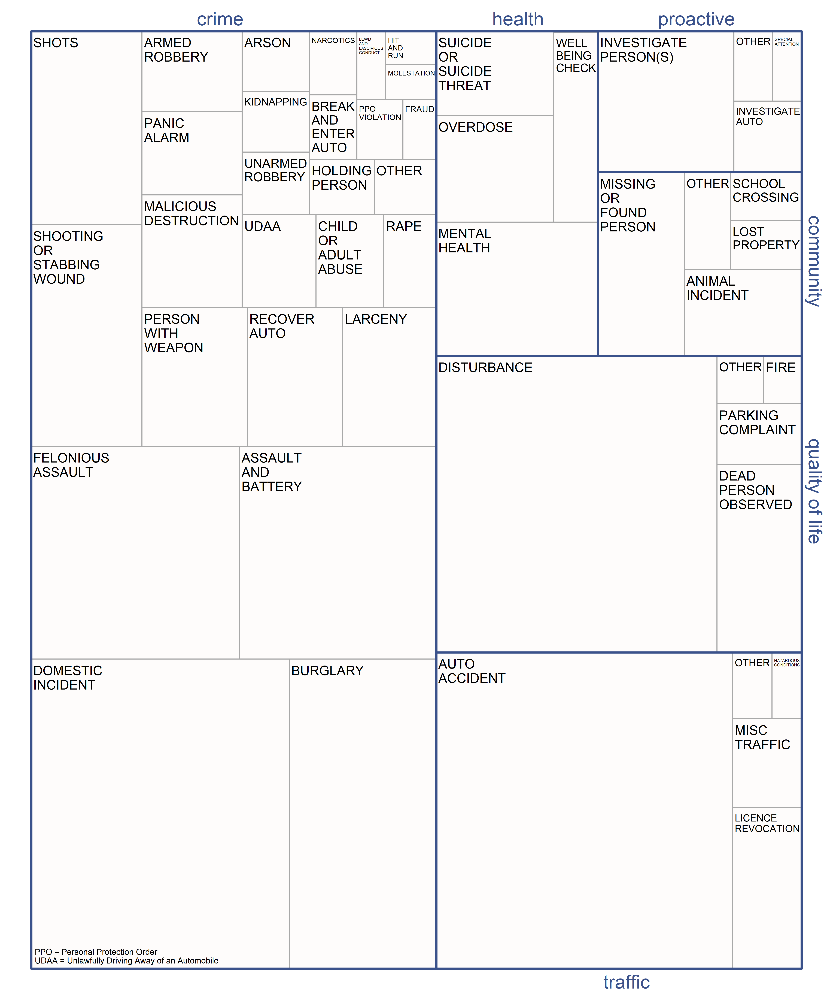

\begin{center}

Keywords: police, calls for service, 911, demand

\end{center}

\dag Netherlands Institute for the Study of Crime and Law Enforcement (NSCR), Amsterdam, Netherlands. \linebreak
\* Department of Sociology, Utrecht University, Utrecht, Netherlands \linebreak \linebreak \linebreak \linebreak

**ORCID** Samuel Langton (0000-0002-1322-1553). Stijn Ruiter (0000-0003-2872-2710). Tim Verlaan (0000-0002-3048-5817).

**Acknowledgments** To be completed.

**Disclosure statement** The authors declare that they have no competing interests.

**Funding details** This research is part of the NSCR research program _What Works in Policing. Towards	Evidence-Based Policing in the Netherlands_, which has been funded by Netherlands Police.

**Availability of data** The data and code used in this study are openly available (see https://anonymous.4open.science/r/demand_detroit-FCD3/README.md).


\newpage

```{r setup, include=FALSE}
knitr::opts_chunk$set(echo = F, message=F, comment=F, warning=F, fig.pos = 'H', eval = T)
library(readr)
library(readxl)
library(dplyr)
library(kableExtra)
```

# Background

Amidst austerity measures, growing public expectation, and scrutiny, understanding the public demand for police services has become a priority among evidence-based policing researchers and practitioners [@boulton2017calls]. Without a grasp on the scale ('how much?') and composition ('what type?') of police demand, we are likely to observe sub-optimal and inequitable outcomes for the public, the inappropriate distribution of public funds, and unnecessary strain on officers [@ellison2021understanding; @lum2021can]. Understanding the characteristics of public demand for the police has become particularly pertinent following recent calls to rethink, and in some cases, radically reform, the role and reach of contemporary police forces [@lum2021can].

A recent study from @ratcliffe2021policing sought to describe the complexity and diversity of public demand for police services in Philadelphia, United States (US), during 2019. The study was motivated by the recognition that police spend a considerable proportion of deployed resource resolving incidents which fall outside of the traditional crime-fighting role of the police. Instead, the origins of public demand for the police can often be attributed to a lack of supply and/or accessibility failure in other organisations, such as those providing support for people requiring (mental) health assistance [@wood2021can; @van2017law]. Ratcliffe reported that just 40% of public emergency calls for service during the year were crime incidents. These calls consumed 55% of total officer shift time. The remaining public demand from calls involved community issues (10% of calls, 7% of time), medical/public health incidents (7% of calls, 9% of time), proactive policing (8% of calls, 5% of time), quality of life (24% of calls, 14% of time) and traffic duties (11% of calls and 11% of time). Comparable results were subsequently reported across multiple anonymized police jurisdictions in the US [@lum2021can; see also @lumwash in _The Washington Post_]. 

These descriptive findings provided data-driven evidence to suggest that the police indeed spend considerable amounts of time dealing with incidents in a social rather than solely crime-fighting capacity. This has implications to and beyond policing practice. Findings directly contribute to the fierce and politically-charged debate around the role and responsibilities of police officers in contemporary society. Both @ratcliffe2021policing and @lum2021can were published amidst the backdrop of the killing of George Floyd in May, 2020 and subsequent 'defund the police' protests across the US. Evidence which demonstrates that the public rely on the police for social duties beyond law enforcement suggests that a radical reduction in their role and responsibilities (e.g., through defunding) would increase demand on other social services. Should such radical reform take place without first understanding the scale and composition of public demand for the police, and without preemptively providing appropriate substitutes, there will be no supply to meet this shift in demand. Thus, @ratcliffe2021policing and @lum2021can contributed important empirical data to the (ongoing) discussion on police reform in the US.

Here, we propose an extension of @ratcliffe2021policing and @lum2021can. This extension has two principal components. First, we replicate the main analyses of these existing investigations into the scale and composition of police demand using open study materials. To date, investigations have been conducted on data which are not publicly available and without the materials (e.g., code) to reproduce the results. Open science practices have been identified as fundamental to the aims of evidence-based policing and vital in ensuring that in the long-term, real-life decisions are based on a concrete and replicable pool of evidence [@openedp2019]. In this case, the necessity for a fully open investigation into the scale and composition of police demand is particularly important given the public nature of the debate around police reform and the considerable implications of redefining the role of the police without transparent empirical investigation. It is reasonable for police practitioners and the public to expect a thorough, open and replicable investigation into police demand before academia concludes that the issue is resolved – certainly before findings are used to change or introduce police practice or public policy. Open materials have the additional benefit of being available for re-use in other jurisdictions, helping build a reliable and comparable evidence-base around the scale and composition of police demand across different contexts.

<!-- Second, and relatedly, the materials provided here can be re-used as a tool to conduct further replications for the purposes of comparison and generalization. One way in which our materials facilitate this is through an open classification scheme, namely, the recoding of raw call descriptions into meaningful groups (e.g., 'animal incident'), and the subsequent classification into demand types (e.g., 'quality of life'). As both @ratcliffe2021policing and @lum2021can point out, categorizing call types is challenging and subject to a degree of interpretation. But, without a systematic application of such a classification, we cannot compare jurisdictions, make generalizations, or make iterative improvements to previous studies. Thus, we encourage practitioners and academics to use these materials to help build a reliable and valid evidence-base around the scale and composition of demand for police services. -->

Second, we extend the analyses used by @ratcliffe2021policing and @lum2021can. This includes a direct comparison between different measures of 'officer time', namely, total deployment time and time on scene. These measures have been reported separately in the existing analyses, so the precise impact of their usage on the same data is unclear. We also provide a comprehensive account of the variability in the time consumed by different demand classifications (e.g., crime, community, health). These statistics shed light on the degree to which a disproportionately large amount of officer time is consumed by just a small number of calls - insight which can be used to assess how a reduction in demand, or a shift away from calls for police service towards other social services, might free-up officer time. In addition, we report on the spatial and temporal patterning of each demand classification. Distinctions in these patterns across demand types would be indicative of similarly distinct demand-generating mechanisms (e.g., built environment and sociodemographic backdrop). Such concentrations in time and space might also inform deployment decisions based on officer expertise and experience, and/or collaboration with other services (e.g., mental health professionals).

With these points in mind, this paper describes the emergency demand for police services in a large city, Detroit, US, using open data and open code. All materials are publicly available (see https://anonymous.4open.science/r/demand_detroit-FCD3/README.md). It does so in replication, and where appropriate extension, of the main findings reported by @ratcliffe2021policing and later @lum2021can. In this way, the contribution serves to test the robustness of existing findings, provides the materials required for re-use, reproduction and replication, and provides additional insight through new analyses.

# Describing demand

Given the aims of this study, this section first provides a brief outline of the data and methods used by @ratcliffe2021policing and @lum2021can to describe the scale and composition of emergency reactive police demand.

## Ratcliffe (2021)

Using computer aided dispatch (CAD) data from the Philadelphia Police Department (PPD) the @ratcliffe2021policing study provided a breakdown of calls for police service during 2019. Calls were subset to exclude those which did not require officer dispatch or did not originate from the public. CAD codes, discrete descriptions of incidents based on information available to the dispatcher, were categorized into six broad classifications: community issues, crime, medical/public health, proactive policing, quality of life, and traffic duties. The classification scheme was used to report on the frequency and proportional breakdown of calls relating to each type of demand throughout 2019.

Recognizing that frequency counts of calls for service do not necessarily reflect the amount of police resource consumed by public demand, raw counts were augmented with the time spent by officers on each of the six classifications of demand. This information permits the calculation of a proportional breakdown of police time consumed by the different demand classifications throughout the year. The raw numbers were reported in a table. A visual representation of call types nested within each demand classification was summarized in a tree map graphic. The time committed by officers was calculated from when the call was dispatched to an officer to when the officer indicated that the event had been closed. Here, this is referred to as the _total deployed time_. The aggregate time consumed by different demand classifications was reported using a single count of officer shifts (7.5 hours) over the year.

The spatio-temporal patterning of this demand was summarized in two visuals, focusing specifically on those calls relating to medical/public health. A heatmap showed the mean call volume during hours of the day and days of the week, identifying peak times for demand. A geographic map visualized the spatial patterning of these call count concentrations using kernel density estimation in order to identify hotspots of police demand involving medical/public health issues. To supplement these findings, Ratcliffe also reported on the differences between the initial CAD incident type classification and the final disposition using a Sankey diagram -- again focusing specifically on medical and public health calls.

## Lum et al (2021)

To describe the scale and composition of emergency police demand across the US more broadly, @lum2021can used CAD data from nine different police agencies. The agencies themselves were anonymized. Individual incidents were categorized into fourteen different demand classifications, namely, alarms, disorders, vice, domestic, follow-ups and service requests, mental, medical, missing persons, violence, interpersonal-other, property, suspicions, traffic, and admin, agency and non-crime. The authors reported a proportional breakdown of call counts and police time spent across the nine agencies according to the fourteen demand classifications, including the average (mean). For each agency, the authors also reported the average time spent on each demand classification in minutes, and the average across the nine agencies. No descriptive statistics on the range or spread of these figures was reported. The 'time spent' measure used was the _time on scene_. The authors considered this to be preferable to _total deployed time_ when measuring police demands, since low priority calls may have a non-urgent (slow) response due to the nature of the call, and officers may be reassigned to other duties while on an assignment. A proportional breakdown of the disposition (assist only, report written or arrest citation) was provided for each of the fourteen call types. No spatial or temporal findings were reported. 

# Data

## Detroit calls for service

The data used for this study covers the city of Detroit in Michigan, US. The City of Detroit authority publish 911 emergency calls for service data through their Open Data Portal.^[Accessible via https://data.detroitmi.gov/.] In alignment with @ratcliffe2021policing the data used here is subset for the year 2019 and excludes those calls initiated by an officer in order to capture public-initiated calls. Each individual incident has a corresponding timestamp and location coordinates to define the call in time and space.

For each incident, the police response time and time on the scene are reported. In sum, these comprise the total deployed time officers spend on the incident. Calls which had a _total deployed time_ (response time + time on scene) or _time on scene_ of zero minutes, negative values or missing were excluded. The data permits a distinction between the time spent resolving incidents with and without the response time. As noted, @lum2021can considered the _time on scene_ measure to be preferable. Here, for completeness, both measurements are reported.

Each incident has a _calldescription_ variable which describes the nature of the call. Call descriptions involving administrative duties (e.g., "start of shift information"), completely unknown problems, and non-deployment (e.g., "employee call in / time off") were removed. This left 207 unique call description categories. In the interests of parsimony and ease of interpretation these categories were recoded into 99 broader call descriptions.^[We refer readers to the corresponding GitHub repository for further details on how call descriptions were combined (https://anonymous.4open.science/r/demand_detroit-FCD3/README.md). Readers unfamiliar with R code can review the reference table entitled 'categorization summary'.] This included the removal of incidents involving transporting prisoners and executing warrants, which were deemed to have been erroneously flagged as not being officer-initiated. Each call description was then categorized into the six demand type classifications used in @ratcliffe2021policing, namely, crime, community, medical/public health, proactive, quality of life and traffic. 2.8% of incidents were deemed unclassifiable. For each of the six demand classifications an 'other' incident type was generated for those incidents which consumed less than 0.2% of total deployed time during the year. This left a total of 49 unique categories for the reported breakdowns, capturing ~260,000 individual public calls for service in Detroit during 2019. No information on the final disposition of calls is provided in the open data.

# Methods

The methods used largely replicate those used by @ratcliffe2021policing and @lum2021can, and where appropriate, extensions. First, descriptive statistics and a treemap graphic provide an account of the scale and composition of police demand during the year. Second, visualizations summarize the spatial and temporal patterning of this demand.

## Descriptive statistics

Summary statistics describe the overall composition of demand according to the six demand type classifications. This includes call frequency counts, a proportional breakdown of call counts, and a proportional breakdown of police time. Both _total deployed time_ and _time on scene_ measures of police resource are reported. The proportional breakdown of _time on scene_ is visualized using a treemap graphic for each incident type nested within the demand classifications. The equivalent graphic for _total deployed time_ is available in the corresponding GitHub repository.

A series of descriptive statistics summarize the time consumed by each demand type. As an aggregate measure, we report the sum time spent on each demand classification by the number of officer shifts.^[Consistent with Ratcliffe (2021) a shift is defined as 7.5 hours. The sum total of hours for each demand classification over the year is divided by 7.5.] For comprehensiveness and transparency, we also report the mean, median, standard deviation, range, and in the Appendix, a histogram of the underlying distribution in minutes. This sheds on light on how long a 'typical' call might take while noting a probable skew in the distribution. Such a skew would suggest that averages of time [e.g., @lum2021can] or aggregate measures of time [e.g., @ratcliffe2021policing] in isolation are insufficient and potentially mask important underlying variation, namely, that a small number of high-demand calls drag up the mean and inflate aggregate measures of time. To investigate this distribution, we plot Lorenz curves for each demand classification. Lorenz curves plot the cumulative distribution of a variable (in this case, time on scene) against the cumulative distribution of a unit (in this case, calls) [@bernasco2017more]. By way of example, we report on these figures according to arbitrary thresholds of 25% and 50%. This sheds light on the degree to which a disproportionately large amount of officer time might be consumed by just a small number of calls.

## Spatio-temporal patterning

The temporal patterning of the six demand type classifications are visualized using a heatmap of mean call counts, aggregated by day of the week, and hour of the day. To summarize the spatial patterning, call location coordinates are aggregated to synthetic grid cells using spatial joins. Grid cells are defined as 1000 ft$^2$ (305m$^2$) -- a size deemed appropriate based on a balance between capturing localized variation and interpretable visualizations. 2% of incidents are excluded from the spatial visualizations due to incomplete geographic information. To accurately convey the resource deployed to each area during the year, maps visualize the aggregate _time on scene_ (in hours) within each grid cell over the course of the year, for each demand type classification. The equivalent raw count maps are available in the Appendix. In this way, we visualize the spatio-temporal patterning of demand in a manner comparable to @ratcliffe2021policing, but here, we provide a comparison across different demand classifications and two different measures of demand.

## Data and methods summary

To summarize the various descriptions of police demand replicated and/or extended in this study, a checklist is outlined in Table 1. Broadly, this demonstrates that, with the exception of the final disposition, this study provides a comprehensive replication of the analyses reported by @ratcliffe2021policing and @lum2021can. Either identical descriptive statistics are reported in replication of one or both existing studies, or additional analyses are provided for enhanced insight and transparency.

\newpage

```{r table1}
options(knitr.kable.NA = '')

table1_df <- read_xlsx("results/table1_methods_comparison.xlsx")

kable(table1_df, caption = "Summary of the various descriptions of demand replicated or extended in this study. Measures were reported for demand classification unless otherwise stated.",
      booktabs = T, longtable = T, linesep = "", format = "latex") %>%
    kable_styling(latex_options = c("striped"),
                  font_size = 10, full_width = F) %>%
  column_spec(column = c(2,3,4), width = c("2cm", "2cm", "2cm") ) %>%
  row_spec(row = 14, hline_after = 14) %>%
  row_spec(row = 15, italic = T)
```

# Results

## Scale and composition

The frequency counts and proportional breakdowns for each demand type classification are reported in Table 2. This demonstrates that in Detroit, a considerable proportion of citizen calls for service, and in turn, time spent by officers, is committed to a diverse array of (often non-criminal) issues. Just 44% of emergency calls for service related to crime incidents. These crime incidents consumed 47% of total deployed time throughout the year, although the figure increases to 51% when considering time on scene in isolation. This likely reflects the fact that crime-related calls have higher priority, and in turn, a swifter response time. The remainder of total time on scene is spent dealing with community issues (5%), public and mental health (7%), proactive policing (4%), quality of life incidents (15%) and traffic duties (16%). 

```{r table2}
table2a_df <- read_csv("results/table2_des_stats_total_time.csv")
table2b_df <- read_csv("results/table2_des_stats_tos.csv")

table2_df <- table2a_df %>% 
  select(-`Demand type`, -Count, -`Count (%)`) %>%  
  bind_cols(table2b_df) %>% 
  select(`Demand type`, Count, `Count (%)`,
         `Time on scene (%)`, `Total deployed time (%)`,  `Total deployed time (shifts)`) %>%  # reorder for final table.
  rename( `Total deployed \n time (shifts)` =  `Total deployed time (shifts)`)

kable(table2_df, caption = "Breakdown of frequency counts and time consumed for each demand type. Total deployed time is the sum of the time on scene and response time.",
      booktabs = T, longtable = T, linesep = "", format = "latex") %>%
    kable_styling(latex_options = c("striped"),
                  font_size = 10, full_width = F) %>% 
  column_spec(column = 1:6, width = c("2cm","2cm","2cm","2.5cm","2.5cm","2.5cm"))
```

The proportional breakdown of time spent on scene for each incident type, grouped by the six demand classifications, is visualized in Figure 1.^[The purpose of the graphic is to provide an broad summary, in replication of Ratcliffe's visual. The numbers underlying the graphic are reported in the corresponding GitHub repository.] This figure demonstrates the diversity and complexity of public demand for police services in Detroit. Time consumed on the scene of crime incidents is largely comprised of domestic incidents, burglary and assault. For traffic incidents, police time was mostly spent attending to accidents, while for quality of life, attending to disturbances consumed the most time on scene. Calls relating to public health involved mental health incidents, overdoses, (threats of) suicide  and well-being checks. Proactive incidents largely involved investigations, while time consumed on community issues consisted mostly of missing/found persons and animal incidents (e.g., aggressive dogs).

## Time distributions 

To further quantify the resources consumed, Table 3 summarizes the time spent on the scene for each demand classification in minutes. A histogram of the underlying distributions are reported in the Appendix. Table 3 demonstrates a number of things. First, there is a modest amount of variation in the typical time at scene of different types of emergency call. For instance, the mean time spent on the scene of traffic incidents (55 minutes) and crime (51 minutes) is considerably more that quality of life issues (31 minutes) or proactive activity (28 minutes). These differences will be a result of a combination of factors, including the complexity and severity of incidents and the number of officers required to attend the scene. Second, there is considerable variation in the time consumed by incidents _within_ each demand type. While many calls are resolved in minutes, a handful consume hours of cumulative officer time, resulting in a highly skewed distribution. This highlights how mean or aggregate summary statistics of police time as a measure of demand can mask (important) underlying variation.

```{r table3}
table3_df <- read_csv("results/table3_des_stats_tos.csv")

kable(table3_df, caption = "Descriptive statistics of minutes spent on scene for each demand type classification.",
      booktabs = T, longtable = T, linesep = "", format = "latex") %>%
    kable_styling(latex_options = c("striped"),
                  font_size = 10, full_width = F) %>% 
  column_spec(column = 1:6, width = c("2.5cm","1cm","1cm","1cm","1.2cm", "1cm"))
```

\newpage

```{r fig1, fig.align = "center", fig.cap = "Proportional breakdown of police time consumed over the year, defined as time spent on the scene, for each call category.", out.width = "\\textwidth"}

```

\newpage

Figure 2 visualizes the disproportionately in time spent on calls explicitly using Lorenz curves for each demand classification. These can be compared against the reference line of perfect equality. Here, the line of perfect equality represents a situation in which officer time is distributed evenly across all calls. In reality, we can see that this is not the case: the Lorenz curves for each demand classification deviate considerably from perfect equality. The curves for each classification are almost indistinguishable, so we focus on the curve for all calls (in blue). This shows that 50% of the total time officers spent on the scene during 2019 was consumed by just 15% of calls. 25% of time on scene was consumed by just 5% of calls. In other words, a small amount of emergency calls for service account for disproportionately large amount of police resources out on the street. This finding is consistent (and comparable) across all six classifications of demand.


```{r fig2, fig.align="center", fig.cap = "Lorenz curve for time spent on scene across all calls (in blue). Lorenz curves in grey for each of the six demand classifications."}

```

## Spatio-temporal patterning

Mean incident counts by day of the week and by hour, for each demand classification, are visualized in Figure 3. This demonstrates that the different sources of public demand for police services, as indicated by the six demand classifications, can have a distinct temporal patterning. Community calls appear to concentrate on weekdays, around lunchtime, when other classes of demand are low. Crime and quality of life-related calls both appear to occur in the evening and early hours of the morning. Traffic incidents concentrate in the evenings, particularly on a Friday. Proactive policing does not have a distinct hourly patterning, but this could be attributed to the low hourly counts. Calls relating to health issues, the primary interest of @ratcliffe2021policing, appear to largely take place in the evening and early morning.

The spatial patterning of police demand in Detroit, defined as the aggregate time spent on scene throughout the year, is visualized for each demand classification in Figure 4.^[Noting that the aggregate time spent on scene may be influenced by outliers, the raw count maps and underlying distributions are reported in the Appendix. These indicate that 'high time' outliers do not seriously misrepresent the aggregate figures in Figure 4.] This demonstrates that the time police spent attending to incidents is highly concentrated in space, and can vary between different demand types. The police spend a considerable amount of time around the Wayne State University (WSU) and Midtown attending to community, proactive and quality of life calls for service. Officers spent vast amounts of time on crime-related calls in or near hospitals, most notably, the Henry Ford Hospital. Police time spent attending to health-related calls concentrates in and around WSU and Midtown, but also among grid cells containing mental health and well-being facilities outside of the city center. Time on traffic incidents have a distinct spatial patterning along arterial roads into Downtown.

\newpage
```{r fig3, fig.align = "center", fig.cap = "Mean call counts by day and hour, for each demand type.", out.width = "\\textwidth"}
knitr::include_graphics("visuals/fig3_time_heat_tos.png")
```

```{r fig4, fig.align = "center", fig.cap = "Spatial patterning of the aggregate time spent on scene (in hours) for each demand type.", out.width = "\\textwidth"}

```
\newpage

# Discussion

In replication and extension of the main findings reported by @ratcliffe2021policing and later @lum2021can this contribution has described the scale and composition of calls for police service in Detroit, US. Broadly speaking, the results presented here provide robustness to those reported by @ratcliffe2021policing and @lum2021can. There is now substantial empirical evidence to demonstrate that, in multiple jurisdictions, the public rely on the police for both social _and_ crime-fighting functions. A reduction in the capacity of the police to meet this emergency demand, without first providing appropriate, capable and accessible replacement emergency services, could have considerable implications for public safety and well-being. This contribution provides the first such demonstration using open data and open code, opening up analyses for scrutiny, re-use, and extension by the public, academics and/or police practitioners. We encourage usage of the materials provided with this study to replicate analyses across other jurisdictions. In doing so, we hope to see a consistent and reliable evidence-base across different contexts for the purposes of comparison and generalization.

In this study, calls were categorized according the six classes used by @ratcliffe2021policing. The overall composition of police demand in terms of call volume and proportional time consumed are remarkably similar. A considerable volume of calls for service, and in turn, a considerable proportion of deployed police time, relate to incident types which do not fall under the traditional 'crime-fighting' role of the police. Instead, the police fulfill a variety of other social service functions, including the resolution of public (mental) health incidents and resolving community issues. That said, descriptive statistics which drill down into the underlying distribution of officer time consumed by each demand type provide additional insight which would otherwise be overlooked. First, it is clear that there is considerable variation in the amount of time consumed both between and within demand classifications. On a methodological point, this highlights how average (e.g., mean times) or aggregate (e.g., sum times) might mask underlying variation. Second, and relatedly, these extensions demonstrate that a disproportionately large amount of police time is consumed on a small number of emergency calls. 50% of total time on scene in consumed by just 15% of calls. High-demand calls will likely be complex and/or life-threatening incidents which require numerous officers to be present at the scene, or for extended periods of time. A targeted examination of these calls might shed light on the extent to which such high-intensity demands could be reduced or better resolved through or in concert with other public services. Targeted interventions on just a handful of calls could drastically reduce the public demand for police services.

The spatial patterning of demand for police services in Detroit--as measured through the aggregate time spent on scene and raw counts--demonstrates that different demands often originate from different places. Given the specialized training and experience required to deal with certain forms of police demand (e.g., well being checks, suicide threats), forces might consider accounting for this variation when assigning officers to shifts and patrol areas, or organizing co-patrols with other social service professionals. This might lead to more favourable outcomes for the public and less strain on officers. The spatio-temporal findings also suggests that the underlying environmental factors generating different forms of police demand are (or can be) distinct. Recent research has found that the explanatory frameworks underpinning environmental criminology (e.g., place attractors) are relevant for non-criminal forms of demand, such as those calls involving emotionally disturbed persons [@vaughan2016exploring]. That said, we know little about the nuances of how different environmental characteristics might drive different forms of demand in the same study area. The study materials made available here could be extended using open data resources, such as Open Street Map, to provide a theoretically-driven investigation into the urban character (e.g., place attractors) of high-demand areas according to the six demand classifications. Based on the distinct temporal patterning of different demand types, such analyses should be time-sensitive, capturing, for instance, the ambient population flows of different places throughout the day. To date, ambient population analyses have focused on crime-specific calls for service [@andresen2007hot] which as we have seen, constitutes only part of the emergency demands placed on police.

The study is not without shortcomings. First, while the Detroit data permits an open and reproducible case site, the raw incident data does not make a distinction between the initial call classification and the final disposition. This would permit a comparison, as conducted by @ratcliffe2021policing, into the extent to which the call handler's initial incident classification changes following the attendance of officers at the scene. Here, we cannot conduct such an investigation. Second, findings presented here, and those reported by @ratcliffe2021policing and @lum2021can, rely on the reliability and validity of police incident classifications. These are imperfect. Evidence from the United Kingdom, for instance, indicates that police under-record the proportion of emergency calls involving persons with mental ill-health, which in turn underestimates the amount of police time consumed by such incidents [@langton2021policing]. Investigations into recording practices and call handler decision-making will be necessary to further understand this issue across US police jurisdictions [see @lum2020constrained; @simpson2021calling].

# Appendix

## Raw count maps

```{r fig5app, fig.align = "center", fig.cap = "Spatial patterning of the raw call counts for each demand classification", out.width = "\\textwidth"}

```

## Time on scene distributions

```{r fig6app, fig.align = "center", fig.cap = "Distribution and descriptive statistics of time spent on scene by demand classification at the call level.", out.width = "\\textwidth"}
knitr::include_graphics("visuals/fig6_histogram_mins_tos.png")
```

# References