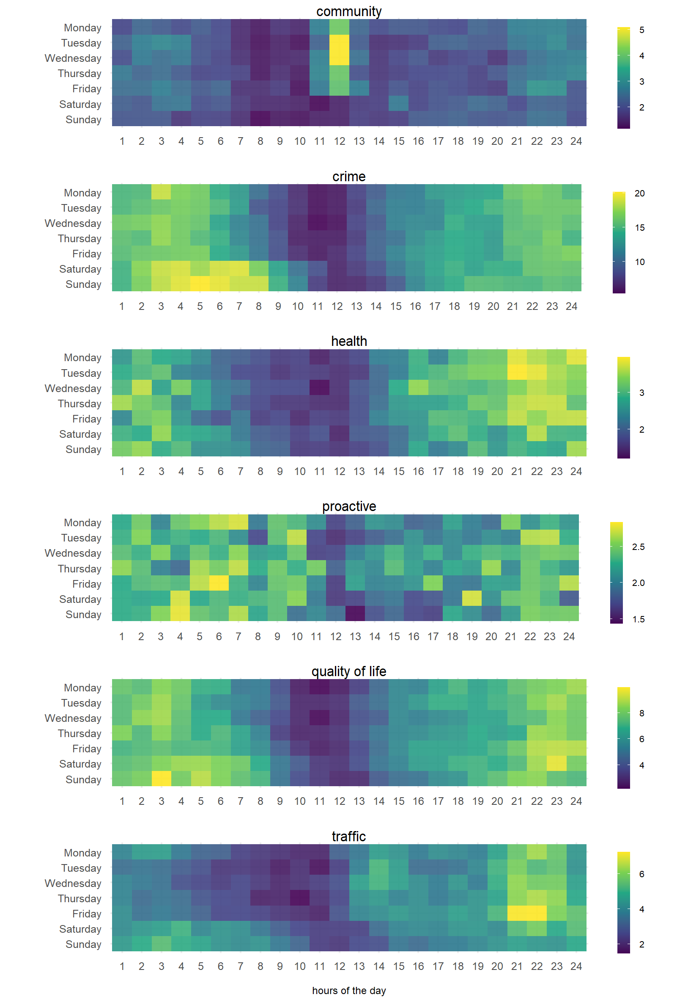
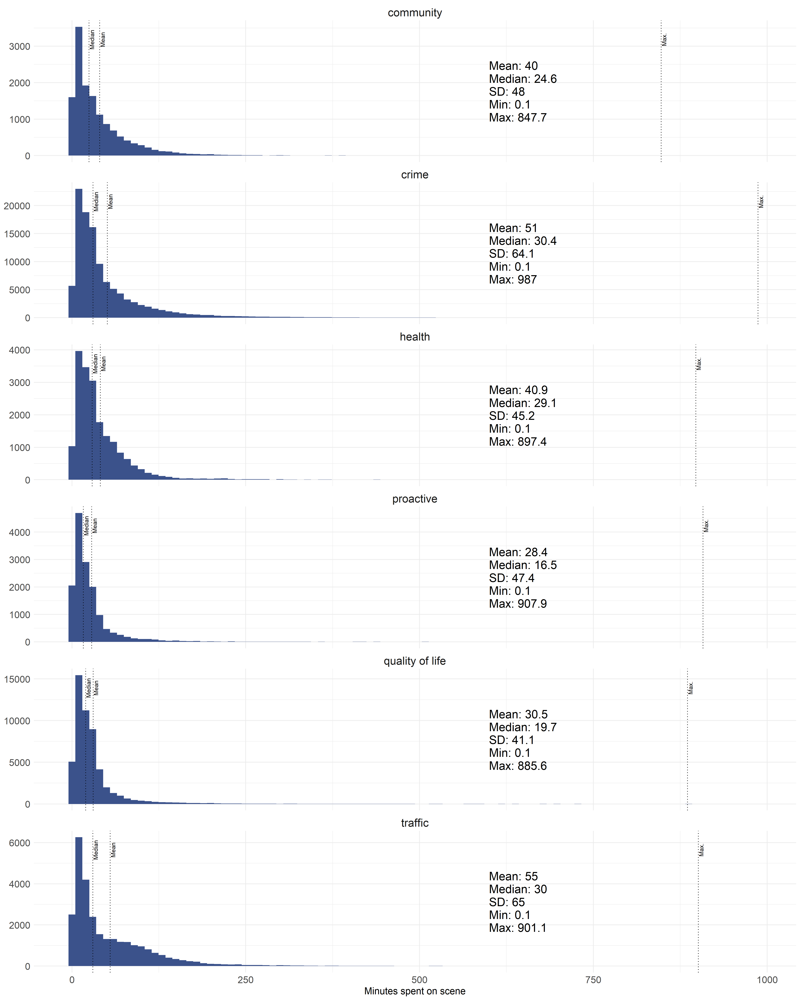

**THIS DOC HAS BEEN CREATED PURELY SUMMARIZE THE RESULTS (WITH NO TEXT) IN ONE PLACE. ALL RESULTS PRESENTED HERE ARE GENERATED IN THE R SCRPTS.**


\newpage

# Main results

```{r setup, include=FALSE}
knitr::opts_chunk$set(echo = F, message=F, comment=F, warning=F, fig.pos = 'H', eval = T)
library(readr)
library(readxl)
library(dplyr)
library(kableExtra)
```

```{r table1}
table1a_df <- read_csv("results/table1_des_stats_total_time.csv")
table1b_df <- read_csv("results/table1_des_stats_tos.csv")

table1_df <- table1a_df %>% 
  select(-`Demand type`, -Count, -`Count (%)`) %>%  
  bind_cols(table1b_df) %>% 
  select(`Demand type`, Count, `Count (%)`, # ,  `Total deployed time (shifts)`
         `Time on scene (%)`, `Total deployed time (%)`) #%>%  reorder for final table.
  # rename( `Total deployed \n time (shifts)` =  `Total deployed time (shifts)`)

kable(table1_df, caption = "Breakdown of frequency counts and time spent on each demand type. Total deployed time is the sum of the time on scene and response time.",
      booktabs = T, longtable = T, linesep = "", format = "latex") %>%
    kable_styling(latex_options = c("striped"),
                  font_size = 10, full_width = F) %>% 
  column_spec(column = 1:6, width = c("2cm","2cm","2cm","2.5cm","2.5cm","2.5cm"))
```

\newpage

```{r fig1, fig.align = "center", fig.cap = "Proportional breakdown of police time consumed over the year, defined as time spent on the scene, for each call category.", out.width = "\\textwidth"}
knitr::include_graphics("visuals/fig1_time_tos.png")
```

\newpage

```{r table2}
table2_df <- read_csv("results/table2_des_stats_tos.csv")

kable(table2_df, caption = "Descriptive statistics of minutes spent on scene for each demand type classification.",
      booktabs = T, longtable = T, linesep = "", format = "latex") %>%
    kable_styling(latex_options = c("striped"),
                  font_size = 10, full_width = F) %>% 
  column_spec(column = 1:6, width = c("2.5cm","1cm","1cm","1cm","1.2cm", "1cm"))
```

```{r fig2, fig.align="center", fig.cap = "Lorenz curve for time spent on scene across all calls (in blue). Lorenz curves in grey for each of the six demand classifications."}
knitr::include_graphics("visuals/fig2_lorenz_demands.png")
```

\newpage
```{r fig3, fig.align = "center", fig.cap = "Mean call counts by day and hour, for each demand type.", out.width = "\\textwidth"}

```

```{r fig4, fig.align = "center", fig.cap = "Spatial patterning of the aggregate time spent on scene (in hours) for each demand type.", out.width = "\\textwidth"}
knitr::include_graphics("visuals/fig4_maps_tos.png")
```
\newpage

# Appendix

## Raw count maps

```{r fig5app, fig.align = "center", fig.cap = "Spatial patterning of the raw call counts for each demand classification", out.width = "\\textwidth"}
knitr::include_graphics("visuals/fig5_maps_counts.png")
```

## Time on scene distributions

```{r fig6app, fig.align = "center", fig.cap = "Distribution and descriptive statistics of time spent on scene by demand classification at the call level.", out.width = "\\textwidth"}

```

# References